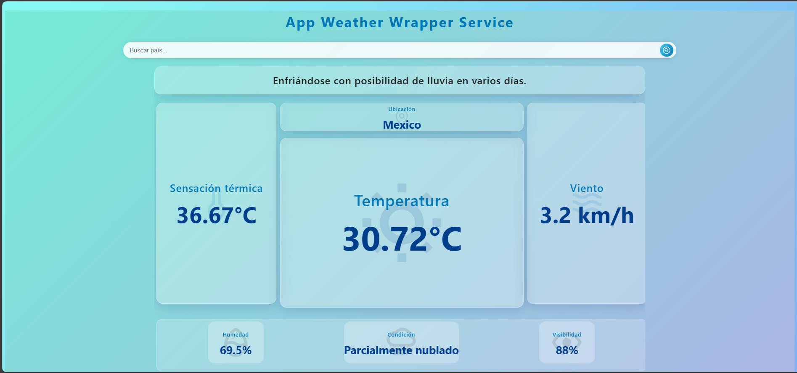

# Weather Wrapper Service

Aplicación web desarrollada en (React + TypeScript) + (NodeJs + Express) que permite consultar el clima de cualquier país utilizando la API de Visual Crossing. El proyecto utiliza Redux Toolkit para la gestión de estado y un diseño moderno con efectos visuales.



## 🌐 Live Demo

Explora la demostración en vivo del proyecto:
[Weather_Wrapper_App](https://weather-wrapper-app.vercel.app/)

## Características

- Búsqueda de clima por país.
- Visualización de temperatura, sensación térmica, viento, humedad, visibilidad y condición.
- Interfaz responsiva y atractiva con animaciones y glassmorphism.
- Estado global gestionado con Redux Toolkit.
- Consumo de la API de Visual Crossing con soporte para idioma español.
- Redis para el cache de las busquedas.
- **Backend propio** para proteger la clave de la API y servir los datos al frontend.

## Tecnologías utilizadas

- React JS
- Vite
- TypeScript
- Redux Toolkit
- CSS moderno (Glassmorphism, Grid, Flexbox)
- Node.js + Express (Backend)
- Visual Crossing Weather API

[](https://skillicons.dev)

<details><summary><b>Estructura del proyecto</b></summary>

```bash
Weather_Wrapper_Service/
├── .github/
│   └── assets/
│       └── weather-service.png
├── backend/
│   ├── src/
│   │   ├── config/
│   │   │   └── redisClient.js
│   │   └── features/
│   │       └── weather/
│   │           ├── weather.cache.js
│   │           ├── weather.controller.js
│   │           ├── weather.route.js
│   │           └── weather.service.js
│   └── index.js
│   ├── .env
│   ├── package-lock.json
│   └── package.json
├── frontend/
│   ├── public/
│   ├── src/
│   ├── .gitignore
│   ├── eslint.config.js
│   ├── index.html
│   ├── package-lock.json
│   ├── package.json
│   ├── tsconfig.app.json
│   ├── tsconfig.json
│   ├── tsconfig.node.json
│   └── vite.config.ts
├── .gitignore
├── README.md
└── package-lock.json
```

</details>

## 🧰 Get Started

Para poner este proyecto en funcionamiento en su entorno de desarrollo, siga estas instrucciones paso a paso.

### ⚙️ Instalación & Correrlo en Local

**Step 0:**

Note :bangbang: La aplicación utiliza Redis cache para recuperar busquedas repetidas en un tiempo determinado, por lo que debes crear una cuenta en Redis Cloud [here](https://cloud.redis.io/) y declarar las siguientes variables de entorno:
`REDIS_USERNAME`, `REDIS_HOST`, `REDIS_PASSWORD` y `REDIS_PORT` en el archivo `.env`.

Note :bangbang: La aplicación utiliza una API de terceros perteneciente a Visual Crossing [here](https://www.visualcrossing.com/weather-api/) y declarar las siguientes variables de entorno:
`VISUAL_CROSSING_URL_BASE` y `WEATHER_API_KEY` en el archivo `.env`.

**Step 1:**

Download or clone this repo by using the link below:

```bash
git clone https://github.com/ladunjexa/reactjs18-3d-portfolio.git
```

**Step 2:**

Ir al backend
Ejecute el siguiente comando en el directorio para instalar las dependencias:

```bash
cd backend
npm/pnpm install
```

**Step 3:**
Ejecute el siguiente comando para ejecutar el servidor de desarrollo localmente:
El backend se ejecutará normalmente en [http://localhost:3000](http://localhost:3000).

```bash
npm/pnpm run start
```

**Step 4:**

Ir al frontend
Ejecute el siguiente comando en el directorio para instalar las dependencias:

```bash
cd frontend
npm/pnpm install
```

**Step 5:**

Ejecute el siguiente comando para ejecutar el frontend en el navegador:
El frontend se ejecutará en [http://localhost:5173](http://localhost:5173).

```bash
npm/pnpm run dev
```

## 🔒 Environment Variables

Las variables de entorno se pueden usar para la configuración. Deben configurarse antes de ejecutar la aplicación.

**Weather_Wrapper_Service** usa [Redis](https://cloud.redis.io/) como servicio externo. Debe crear una cuenta y obtener las credenciales necesarias para ejecutar la aplicación.

Cree un archivo `.env` en el directorio raíz del proyecto y agregue las siguientes variables de entorno:

```env
REDIS_USERNAME=<REDIS_USERNAME>
REDIS_HOST=<REDIS_HOST_DATABASE>
REDIS_PORT=<REDIS_PORT>
REDIS_PASSWORD=<REDIS_PASSWORD>

```

Ademas de que la aplicación utiliza una API de [Visual Crossing](https://www.visualcrossing.com/weather-api/) como otro servicio externo. Debe crear una cuenta y obtener las credenciales necesarias para ejecutar la aplicación.

En el mismo archivo `.env` agregar las siguientes variables de enterno:

```env
VISUAL_CROSSING_URL_BASE=<VISUAL_CROSSING_URL_API_SERVICE>
WEATHER_API_KEY=<VISUAL_CROSSING_API_KEY>

```

## 🚀 Despliegue

### Despliegue en producción (manual)

Puede crear una compilación de producción optimizada con el siguiente comando:

```bash
npm run build
```

### Despliegue Separado De Backend — Frontend

#### Backend

El servicio de la Web API se encuentra hospedado en Render: link:
— Ver [weather_wrapper_api](https://weather-backend-5m1c.onrender.com/)

#### Frontend

La App de React para consumir la API se encuentra hospedada en Vercel, link:
— Ver [Weather_Wrapper_App](https://weather-wrapper-app.vercel.app/)

## 📋 Licencia

**Weather_Wrapper_App** es software de código abierto
— Ver [licensed as MIT](https://opensource.org/license/mit/) y es de uso gratuito
